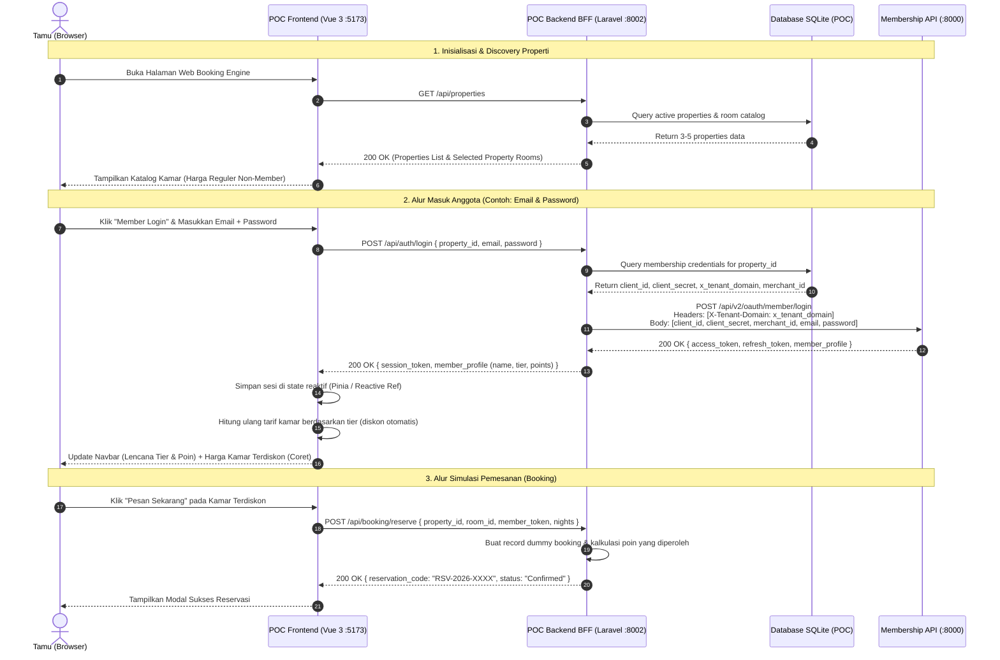

# TDD: Third-Party Booking Engine Multi-Property POC Simulation

**Referensi Dokumen:** [PRD-booking-engine-poc.md](file:///home/busin/projects/adit-projects/booking-engine-poc/PRD-booking-engine-poc.md)  
**Parent Epic Jira:** [`MEM-1175`](https://omnih-membership.atlassian.net/browse/MEM-1175) / Subtask [`MEM-1201`](https://omnih-membership.atlassian.net/browse/MEM-1201) & [`MEM-1202`](https://omnih-membership.atlassian.net/browse/MEM-1202)  
**Status:** Architecture Approved / Ready for Implementation  

---

## 1. Technical Summary
Sistem Proof of Concept (POC) ini dibangun dengan pola arsitektur **Backend for Frontend (BFF)** terpisah:
* **Frontend**: Single Page Application (SPA) berbasis **Vue 3 + Vite** yang merepresentasikan antarmuka web Booking Engine modern.
* **Backend**: Layanan micro-BFF berbasis **Laravel 12 (SQLite)** yang bertindak sebagai perantara aman antara browser dan `membership-api`.
* **Keamanan Kredensial (Zero-Exposure)**: Browser tidak pernah memegang `client_secret`. Kredensial OAuth 2.1 (`client_id`, `client_secret`, `x_tenant_domain`) disimpan aman di database SQLite per-properti (meniru 1:1 pola produksi `dekil-bookingengine`).
* **Multi-Property**: Backend mendukung 3-5 properti hotel percontohan (misalnya Property 1 terhubung ke tenant riil `jeevawasa.localhost`, Property 2 ke tenant alternatif, Property 3 simulasi non-membership/mandiri).

---

## 2. Codebase Findings
Berdasarkan analisis langsung terhadap kode produksi `dekil-bookingengine` dan `membership-api`:
1. **Pola Kredensial Produksi (`dekil-bookingengine`)**:
   - Ditemukan pada Model [`app/MembershipProperty.php`](file:///home/busin/projects/adit-projects/dekil-bookingengine/app/MembershipProperty.php) dan [`app/Classes/OmnihMembership/PushTransactionDetail.php`](file:///home/busin/projects/adit-projects/dekil-bookingengine/app/Classes/OmnihMembership/PushTransactionDetail.php#L242-L267).
   - Sistem produksi tidak menyimpan kredensial properti di `.env`, melainkan di tabel database `membership_properties` dengan kolom: `property_id`, `merchant_id`, `corporate_id`, `access_token`, dan `x_tenant_domain`.
   - Hal ini karena Booking Engine bersifat *multi-property* di mana setiap properti hotel memiliki tenant dan kredensial masing-masing.
2. **Kalkulasi Dinamis Tarif Member (`RateDisplay.js`)**:
   - Ditemukan pada [`app-react/libraries/RateDisplay.js`](file:///home/busin/projects/adit-projects/dekil-bookingengine/app-react/libraries/RateDisplay.js#L938-L950).
   - Booking Engine mencocokkan `tier_id` member yang login dengan konfigurasi rate plan promo (`membership_rateplan`). Jika ada kecocokan, diskon persentase atau potongan nominal dihitung terhadap harga dasar kamar.
3. **Pola OAuth 2.1 di `membership-api`**:
   - Seluruh endpoint otentikasi v2 berada di `/api/v2/oauth/*` di bawah middleware tenancy (`X-Tenant-Domain`).
   - Kredensial divalidasi oleh `OAuthClientService` terhadap tabel tenant `oauth_clients`.

---

## 3. Architecture & Design

### 3.1 Diagram Topologi & Alur Data



---

## 4. Data Model Changes (Database SQLite POC Backend)

Database menggunakan SQLite lokal di `backend/database/database.sqlite` dengan 3 tabel utama:

### 4.1 Tabel `properties`
Menyimpan daftar properti hotel percontohan.
```sql
CREATE TABLE properties (
    id INTEGER PRIMARY KEY AUTOINCREMENT,
    code VARCHAR(50) UNIQUE NOT NULL,
    name VARCHAR(150) NOT NULL,
    description TEXT,
    address VARCHAR(255),
    city VARCHAR(100),
    star_rating INTEGER DEFAULT 4,
    image_url VARCHAR(255),
    has_membership BOOLEAN DEFAULT 1,
    created_at TIMESTAMP NULL,
    updated_at TIMESTAMP NULL
);
```

### 4.2 Tabel `membership_properties`
Menyimpan kredensial integrasi Membership per-properti (identik dengan arsitektur produksi `dekil-bookingengine`).
```sql
CREATE TABLE membership_properties (
    id INTEGER PRIMARY KEY AUTOINCREMENT,
    property_id INTEGER NOT NULL UNIQUE REFERENCES properties(id) ON DELETE CASCADE,
    x_tenant_domain VARCHAR(150) NOT NULL,
    client_id VARCHAR(100) NOT NULL,
    client_secret TEXT NOT NULL,
    merchant_id VARCHAR(100) NOT NULL,
    corporate_id VARCHAR(100) NULL,
    is_active BOOLEAN DEFAULT 1,
    created_at TIMESTAMP NULL,
    updated_at TIMESTAMP NULL
);
```

### 4.3 Tabel `rooms`
Menyimpan katalog kamar dummy dan konfigurasi tarif reguler serta aturan diskon loyalitas.
```sql
CREATE TABLE rooms (
    id INTEGER PRIMARY KEY AUTOINCREMENT,
    property_id INTEGER NOT NULL REFERENCES properties(id) ON DELETE CASCADE,
    name VARCHAR(100) NOT NULL,
    description TEXT,
    capacity INTEGER DEFAULT 2,
    base_price DECIMAL(12, 2) NOT NULL,
    image_url VARCHAR(255),
    is_member_rate_applicable BOOLEAN DEFAULT 1,
    tier_discount_rates TEXT, -- JSON: {"bronze": 5, "silver": 10, "gold": 15, "diamond": 20}
    created_at TIMESTAMP NULL,
    updated_at TIMESTAMP NULL
);
```

### 4.4 Data Seeder (3-5 Properti Dummy)
1. **Property 1: Jeevawasa Luxury Resort Ubud** (Aktif Membership riil)
   - `x_tenant_domain`: `jeevawasa.localhost`
   - Terkoneksi langsung ke database tenant `tenant_jeevawasa` di `membership-api`.
2. **Property 2: Plataran Heritage Borobudur** (Aktif Membership)
   - Disiapkan untuk demonstrasi multi-tenant kedua.
3. **Property 3: Santika Premiere Beach Resort** (Aktif Membership)
4. **Property 4: Grand Sahid City Hotel** (Non-Membership / Regular Booking Engine Only)
   - Untuk memvalidasi properti yang belum pairing dengan sistem keanggotaan.

---

## 5. API / Interface Design (BFF Backend Routes)

Seluruh route didefinisikan di `backend/routes/api.php`:

### 5.1 Discovery & Catalog Endpoints
1. `GET /api/properties`
   - Mengambil daftar properti percontohan yang tersedia.
2. `GET /api/properties/{property_id}/catalog`
   - Mengambil informasi properti aktif dan daftar kamar beserta harga dasar & skema diskon.

### 5.2 Authentication BFF Proxy Endpoints
1. `POST /api/auth/login`
   - **Request**: `{ "property_id": 1, "email": "...", "password": "..." }`
   - BFF menginjeksi `client_id`, `client_secret`, dan header `X-Tenant-Domain` lalu meneruskan ke `membership-api` `POST /api/v2/oauth/member/login`.
   - **Response**: Mengembalikan token akses dan profil member (`name`, `tier`, `points`).
2. `POST /api/auth/otp/send`
   - **Request**: `{ "property_id": 1, "email": "..." }`
   - Meneruskan ke `POST /api/v2/oauth/member/otp/send`.
3. `POST /api/auth/otp/verify`
   - **Request**: `{ "property_id": 1, "email": "...", "otp": "123456" }`
   - Meneruskan ke `POST /api/v2/oauth/member/otp/verify`.
4. `POST /api/auth/google`
   - **Request**: `{ "property_id": 1, "id_token": "..." }`
   - Meneruskan ke `POST /api/v2/oauth/member/google`.
5. `POST /api/auth/logout`
   - **Request**: `{ "property_id": 1, "token": "..." }`
   - Memanggil `POST /api/v2/oauth/token/revoke` dan membersihkan sesi.

### 5.3 Booking Simulation Endpoint
1. `POST /api/booking/reserve`
   - **Request**:
     ```json
     {
       "property_id": 1,
       "room_id": 101,
       "check_in": "2026-09-10",
       "check_out": "2026-09-12",
       "nights": 2,
       "guest_name": "Mr. I Putu Aditya Satriawan",
       "guest_email": "aditya@example.com",
       "is_member": true,
       "applied_tier": "Diamond",
       "total_amount": 2400000
     }
     ```
   - **Response (201 Created)**:
     ```json
     {
       "success": true,
       "message": "Reservation confirmed successfully.",
       "data": {
         "reservation_code": "RSV-20260904-8841",
         "room": "Deluxe Pool Villa",
         "property": "Jeevawasa Luxury Resort Ubud",
         "total_paid": 2400000,
         "points_earned_est": 240,
         "status": "CONFIRMED"
       }
     }
     ```

---

## 6. Edge Cases & Error Handling
1. **Properti Tanpa Membership (Property 4)**:
   - Jika properti tidak memiliki relasi di `membership_properties`, tombol login dinonaktifkan atau menyembunyikan penawaran harga anggota.
2. **Kredensial Salah / User Belum Terdaftar**:
   - BFF menangkap error `401 / 422` dari `membership-api` dan meneruskan pesan error yang ramah ke frontend.
3. **Koneksi Jaringan Antar-Container Down**:
   - Jika `membership-api` tidak dapat dijangkau, BFF mengembalikan response `503 Service Unavailable` dengan pesan `"Membership service is temporarily unreachable"`.
4. **Token Expired saat Reservasi**:
   - Frontend menangani status `401` dengan menampilkan prompt untuk login ulang tanpa menghilangkan draft pilihan kamar.

---

## 7. Dependencies & Integration Points
* **HTTP Client**: `GuzzleHttp\Client` / Laravel `Http` facade untuk komunikasi BFF ke `membership-api`.
* **Database Driver**: SQLite (bawaan PHP & Laravel, zero configuration).
* **Frontend UI Framework**: Vue 3 Composition API (`<script setup>`) + Vanilla CSS modern yang elegan (tema luxury hospitality).

---

## 8. Testing Strategy
* **Backend Integration Test**:
  - Test query properti dan resolusi kredensial dari SQLite.
  - Mocking / live hit ke `membership-api` via endpoint `/api/status` dan `/api/auth/login`.
* **Frontend Component & E2E Flow**:
  - Validasi alur pemilihan 3-5 properti.
  - Validasi perubahan harga seketika saat status auth berubah (Non-Member vs Diamond Member).
  - Validasi submit booking konfirmasi.

---

## 9. Assumptions
* *Assumption 1*: Pengujian live OAuth 2.1 difokuskan pada properti default (Jeevawasa) yang database tenant-nya (`tenant_jeevawasa`) sudah memiliki `oauth_clients` valid.
* *Assumption 2*: Properti dummy lainnya dapat menggunakan tenant simulasi atau fallback response jika belum dibuatkan tenant database di `membership-api`.

---

## 10. Rollout Plan
1. Buat migrasi SQLite dan Model (`Property`, `MembershipProperty`, `Room`) di `backend/`.
2. Buat Database Seeder untuk 3-5 properti dummy dan kamar.
3. Buat Service & Controller BFF untuk integrasi OAuth 2.1 dan reservasi.
4. Buat antarmuka Vue 3 (Navbar, Property Selector, Room Catalog, Auth Modal, Booking Confirmation).
5. Uji coba lokal end-to-end via Docker (`http://localhost:5173`).

---

## 11. Risks & Mitigation
* **Risiko**: Nilai tukar diskon tier tidak seragam antar-hotel.
  - *Mitigasi*: Disimpan dalam kolom JSON `tier_discount_rates` per kamar sehingga fleksibel dikonfigurasi per-properti.
* **Risiko**: Kebocoran rahasia klien (*client secret*).
  - *Mitigasi*: Diisolasi sepenuhnya di backend BFF; tidak ada `client_secret` yang dikirim ke browser Vue.
